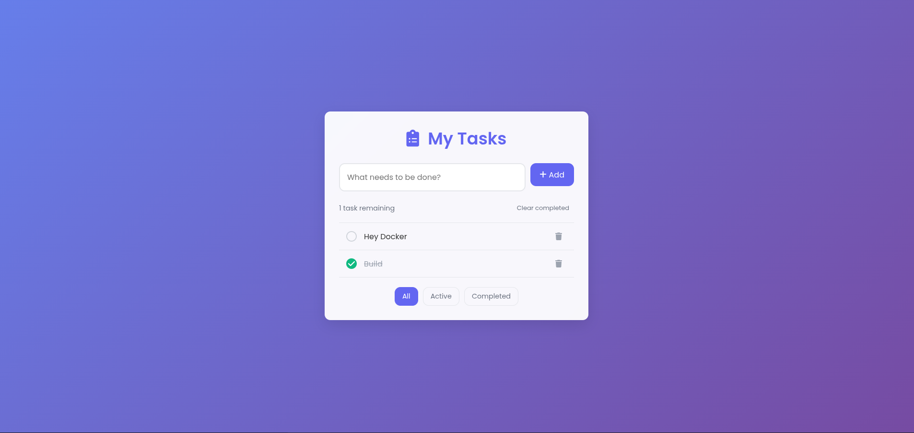

# Docker for Static Frontend: A Learning Project

Welcome to this learning repository. This project demonstrates how to containerize a simple static HTML/CSS/JS website using Docker.

## Overview

This repository was created primarily to learn Docker containerization principles. It uses a basic to-do list application built with HTML, CSS, and JavaScript as the example content, but the focus is on the Docker implementation rather than the application itself.

## What You'll See Running



*A simple static to-do list application running in a Docker container.*

## Learning Focus

- **Docker Containerization:** Understanding how to package static web content in a Docker container
- **Nginx Configuration:** Using Nginx as a web server for static content in Docker
- **Build Process:** Learning the Docker build and run workflow
- **Port Mapping:** How to expose container ports to the host system

## Prerequisites

- Docker installed on your system
- Basic understanding of terminal/command line
- A web browser for viewing the result

## Docker Implementation Details

This project demonstrates several key Docker concepts:

1. **Containerizing Static Content:** Using a lightweight Docker container to serve static HTML/CSS/JS
2. **Multi-stage Builds:** The Dockerfile may employ multi-stage builds to optimize the final image
3. **Production-Ready Nginx:** Using Nginx to efficiently serve static content
4. **Volume Mounting:** Optional volume mounting for development workflow

## How to Use This Learning Project

1. **Clone the Repository:**
    ```bash
    git clone <repository-url>
    cd test-site
    ```

2. **Build the Docker Image:**
    ```bash
    # Build the Docker image with a name tag for easy reference
    docker build -t static-site-docker ./frontend
    ```

3. **Run the Docker Container:**
    ```bash
    # Run in detached mode (-d) and map port 80 on the container to port 80 on your host
    docker run -d -p 80:80 static-site-docker
    ```

4. **Access Your Containerized Static Site:**
    Open your web browser and visit `http://localhost` to see the static site running in Docker.

## Docker Commands to Learn

Here are some useful Docker commands to practice with this project:

```bash
# List all running containers
docker ps

# Stop a running container
docker stop <container-id>

# Remove a container
docker rm <container-id>

# List all images
docker images

# Remove an image
docker rmi static-site-docker

# View container logs
docker logs <container-id>

# Access shell in the container
docker exec -it <container-id> /bin/sh

# Build with no cache (for testing changes)
docker build --no-cache -t static-site-docker ./frontend
```

## Learning Takeaways

- How to serve static content with Docker
- Basic Nginx configuration for Docker
- Understanding Docker's networking and port mapping
- The efficiency of containerizing even simple web applications
- Docker build context and file organization

## Further Learning

- Try modifying the Dockerfile to use different base images
- Experiment with multi-stage builds
- Set up volume mounts for development workflow
- Implement Docker Compose for more complex setups

This project is meant as a learning tool for Docker, using a simple static site as the example content.

Happy containerizing!